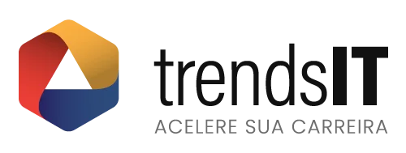
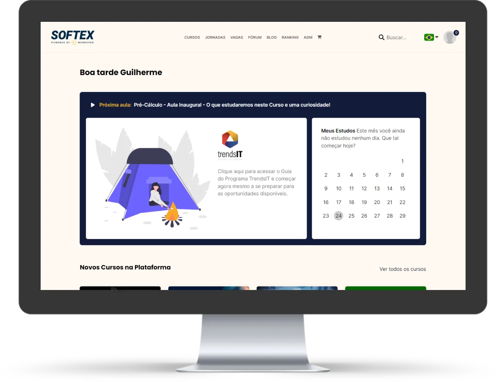

O <strong>TrendsIT – Capacitação &amp; Residência</strong> é uma iniciativa do Ministério da Ciência e Tecnologia com realização do Núcleo Softex Campinas e coordenação do Softex Nacional. Trata-se de um programa gratuito que visa oferecer a alunos capacitação, aperfeiçoamento do portfólio de conhecimentos técnicos e comportamentais de e vivência profissional mercado de Tecnologia da Informação. Ao mesmo tempo, busca suprir a carência de profissionais qualificados no mercado.

 
 

<h2><strong>Sobre o programa</strong></h2>

O TrendsIT consiste em duas etapas distintas: <strong>capacitação</strong> e <strong>residência</strong>.

<h4>Capacitação</h4>

Compreende as modalidades de nivelamento e aprofundamento de competências e conhecimentos requeridos para preparar profissionais para atender as demandas por vagas de empresas e ICTs. Ela é realizada por meio de cursos on-line assíncronos em uma plataforma de EAD especialmente preparada para a capacitação de desenvolvedores full-stack e mobile para IOS e Android.

Essa etapa se desenvolve em três partes: nivelamento (teórico e prático), aprofundamento (para desenvolvimento full Stack ou mobile) e competências comportamentais, onde os alunos serão capacitados em competências socioemocionais utilizadas tanto nos ambientes de trabalho e pessoal, como comunicação eficaz, trabalho em equipe, resolução de conflitos, pensamento crítico, liderança, criatividade e inteligência emocional.&nbsp;

O programa conta também com uma etapa especial de suplementação para quem tiver dificuldades em acompanhar as etapas iniciais de nivelamento. Ao final de cada etapa, espera-se que o aluno tenha adquirido novas competências profissionais. Todos que concluírem satisfatoriamente as etapas de capacitação técnica e comportamental receberão um certificado de participação, onde então serão direcionados para a segunda etapa do projeto.

<h4>Residência</h4>

Tem por objetivo a qualificação dos profissionais do setor por meio de sua inserção em ambientes e projetos reais de empresas parceiras do programa ou ICTs – Instituições Científicas e de Inovação Tecnológica. Aqui, os alunos poderão praticar e expandir as competências e conhecimentos técnicos e comportamentais adquiridos na jornada de capacitação.&nbsp;

A residência será cumprida em regime de tempo integral, com carga horária de 6 (seis) horas diárias, totalizando 30 (trinta) horas semanais, pelo período de 6 (seis) meses, envolvendo atividades práticas no ambiente de trabalho, apoiado por profissionais da empresa ou ICTs. Os alunos selecionados receberão uma ajuda de custo no valor de R$ 1.100,00.&nbsp;

Os estágios poderão ser realizados de forma presencial, remota ou híbrida conforme as diretrizes estabelecidas pelos parceiros em seus respectivos editais de chamamento. Os editais também informarão o que as empresas esperam dos alunos e qual a área específica que o aluno poderá se especializar durante a residência.&nbsp;

As atividades de residência incluem atividades como compor equipes de projetos, pesquisas de ferramentas e tecnologias, execução de demandas definidas pelos gerentes de projetos, elaboração de relatórios de atividades e documentação técnica, entre outras.

<h2><strong>Empresas parceiras </strong></h2>

O TrendsIT também reúne companhias localizadas em várias regiões do país, que contribuem para a formação dos conteúdos de acordo com as especialidades demandadas em seus respectivos mercados. Os currículos de todos aqueles que concluírem a etapa de capacitação, independentemente de sua participação ou não na etapa de residência, serão disponibilizados a todas as empresas parceiras interessadas na contratação de novos profissionais de TI.

